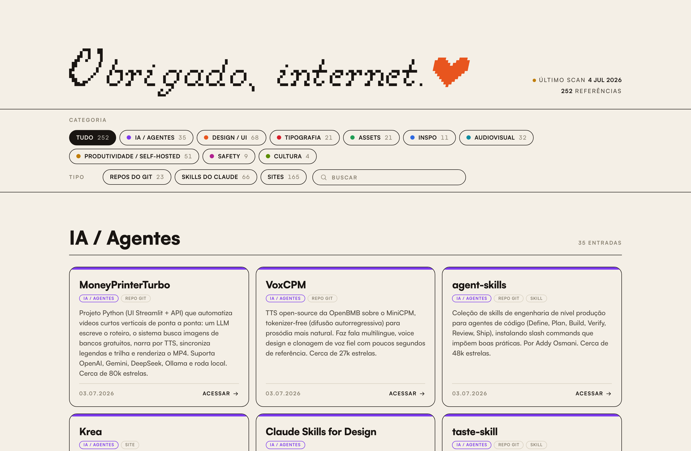
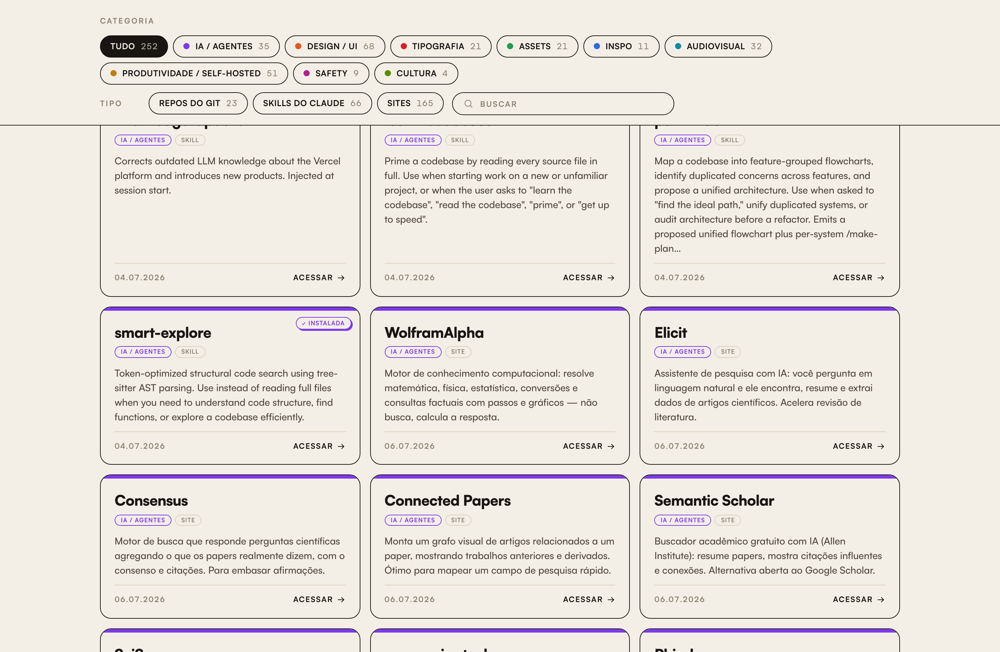

<p align="center">
  
</p>

# Catálogo de Referências

Um **catálogo pessoal de ferramentas, sites e recursos** — cards com descrição, categorias coloridas, busca e filtros. Você adiciona referências colando uma **URL**, soltando um **print**, ou (opcional) um **link de rede social**: uma **IA (Google Gemini)** lê o conteúdo, categoriza e cria o card sozinha.

Sem framework e sem "build": um `index.html` estático + um servidor simples (`server.mjs`). Publica em minutos, mesmo **sem saber programar**.

> **Este guia é para nível ZERO.** Se você nunca publicou nada, siga a **Parte 1** clicando exatamente onde indicado. Não precisa instalar nada no seu computador.

---

## ⭐ Os dois superpoderes

O que torna este catálogo diferente de uma lista de links comum:

### 🧲 Digest universal — jogue QUALQUER coisa, a IA entende e cataloga

Você **não** precisa preencher formulário, escrever descrição nem escolher a categoria. Você **joga o conteúdo** — no formato que for — e uma **inteligência artificial lê, entende e devolve o card pronto** (título, descrição analítica, categoria e tipo, tudo sozinho):

| Você joga… | …e a IA faz |
|---|---|
| 🔗 **Link / URL** (site, repositório, artigo) | abre a página, entende e resume |
| 🖼️ **Print / imagem** | reconhece a ferramenta na tela — e se o print tiver **várias**, cria **vários cards de uma vez** |
| 🎬 **Vídeo** (Reel, Short, TikTok, YouTube) | **vê os quadros** (o texto que aparece na tela) **e ouve o áudio** (a fala) para captar tudo que foi mostrado ou dito |
| 🎧 **Áudio** | transcreve e cataloga o que foi falado |
| 🎠 **Carrossel** (Instagram/LinkedIn) | cada slide que traz uma referência vira um card, sem duplicar |

É **um único lugar** para transformar qualquer coisa que você achou pela internet num card organizado.

> 🔑 **Precisa de uma chave gratuita do Google Gemini** (a "IA"). Sem ela o catálogo funciona normalmente — você só adiciona os cards na mão. **Ligar a IA leva ~2 minutos**, veja a **[Parte 2](#parte-2--ligar-a-ia-o-digest-universal)**. *(Vídeo, áudio e carrossel de redes sociais também usam o Cobalt — opcional, [Parte 5](#parte-5--avançado-links-de-rede-social-com-o-cobalt).)*

### 🖱️ Reclassificar é só ARRASTAR

Colocou na categoria errada? Quer mudar o tipo? **Segure o card e solte em cima de outra bolinha de categoria ou de tipo** — pronto, recategorizado na hora. Nada de menu, formulário ou editar código. *(Aparece só para quem desbloqueou a edição com a senha.)*

---

## Índice

- [O que dá pra fazer](#o-que-dá-pra-fazer)
- [Parte 1 — Publicar o SEU catálogo (do zero)](#parte-1--publicar-o-seu-catálogo-do-zero)
- [Parte 2 — Ligar a IA (o digest universal)](#parte-2--ligar-a-ia-o-digest-universal)
- [Parte 3 — Trocar ou atualizar as chaves depois](#parte-3--trocar-ou-atualizar-as-chaves-depois)
- [Parte 4 — Publicar um espelho público (somente leitura)](#parte-4--publicar-um-espelho-público-somente-leitura)
- [Parte 5 — (Avançado) Links de rede social com o Cobalt](#parte-5--avançado-links-de-rede-social-com-o-cobalt)
- [Rodar no seu computador (opcional)](#rodar-no-seu-computador-opcional)
- [Personalizar (categorias, cores, título)](#personalizar-categorias-cores-título)
- [Modelo de dados](#modelo-de-dados)
- [Todas as variáveis de ambiente](#todas-as-variáveis-de-ambiente)
- [Perguntas frequentes](#perguntas-frequentes)

---

## O que dá pra fazer

- **Catalogar** links em **9 categorias** (IA, Design, Tipografia, Assets, Inspo, Audiovisual, Produtividade/Self-hosted, Safety, Cultura) e **3 tipos** (Site, Repo, Skill).
- **Buscar** e **filtrar** por categoria (clique = uma; `Shift`+clique = somar) e por tipo.
- **Digest universal por IA** ⭐: jogue **URL, print, vídeo, áudio ou carrossel** — a IA lê e cria o card ([veja acima](#-os-dois-superpoderes)).
- **Reclassificar arrastando** ⭐: pegue um card e solte em outra bolinha de categoria/tipo.
- **Editar na interface**: apagar cards (o ×) direto no catálogo.
- **Prints da home** dos sites (liga/desliga), sem armazenar imagens.
- **Selinho "instalada"** para destacar itens especiais.
- **Espelho público read-only** que reflete o seu catálogo ao vivo.

<p align="center">
  
</p>

---

## Parte 1 — Publicar o SEU catálogo (do zero)

Você vai usar dois sites gratuitos: **GitHub** (guarda o código) e **Railway** (deixa o site no ar). Leva ~10 minutos.

> 💡 O Railway costuma pedir um cartão e cobra a partir de ~US$5/mês depois do crédito inicial de teste. É o custo de manter o site no ar 24h. Dá pra pausar/apagar quando quiser.

### Passo 1 — Copiar o projeto para a sua conta do GitHub

1. Crie uma conta gratuita em **[github.com](https://github.com)** (se ainda não tiver).
2. Nesta página do projeto, clique no botão verde **"Use this template" → "Create a new repository"** (ou em **"Fork"**).
3. Dê um nome (ex.: `meu-catalogo`) e clique **"Create repository"**.

Pronto — agora existe uma **cópia sua** do código no seu GitHub.

### Passo 2 — Criar conta no Railway

1. Vá em **[railway.app](https://railway.app)** e clique **"Login" → "Login with GitHub"**.
2. Autorize o Railway a acessar seu GitHub.

### Passo 3 — Publicar

1. No Railway, clique **"New Project"**.
2. Escolha **"Deploy from GitHub repo"**.
3. Selecione o repositório que você criou no Passo 1.
4. O Railway vai **construir e publicar** sozinho (aguarde uns 2–3 minutos até aparecer "Success").

Seu site já está no ar — mas por enquanto é **somente leitura** (ninguém consegue editar). Vamos ligar a edição e gerar o link.

### Passo 4 — Definir a senha de edição

1. No projeto do Railway, clique no serviço (o quadradinho com o nome do repo) → aba **"Variables"**.
2. Clique **"New Variable"** e crie:
   - **Nome:** `EDIT_TOKEN`
   - **Valor:** uma senha sua (ex.: `minhasenha123`)
3. Salve. O site vai **republicar** sozinho.

> Essa é a senha que você vai digitar no site para desbloquear a edição. Sem ela, o site fica só de leitura para todo mundo. **Guarde bem.**

### Passo 5 — Gerar o link público

1. Ainda no serviço, vá em **"Settings" → "Networking"**.
2. Clique **"Generate Domain"**.
3. O Railway cria um endereço tipo `https://seu-projeto.up.railway.app`. **Esse é o link do seu catálogo.**

### Passo 6 (recomendado) — Não perder os dados

Por padrão, cada vez que o Railway republica, o catálogo poderia voltar ao estado do código. Para **guardar suas adições para sempre**, crie um "Volume":

1. No serviço → **"Settings"** (ou clique com o botão direito no serviço) → **"Add Volume"**.
2. Em **Mount path**, coloque: `/data`
3. Vá em **"Variables"** e adicione: `DATA_DIR` = `/data`
4. Salve. Pronto — agora tudo que você adicionar fica guardado.

✅ **Seu catálogo está no ar.** Abra o link, clique para **desbloquear** e digite a `EDIT_TOKEN`.

---

## Parte 2 — Ligar a IA (o digest universal)

Este é o **superpoder** do catálogo: colar qualquer coisa e a IA cria o card. Para isso você precisa de uma **chave do Google Gemini** (tem plano gratuito e é rápido de obter).

### Como pegar a chave do Gemini (grátis)

1. Acesse **[aistudio.google.com/apikey](https://aistudio.google.com/apikey)** e faça login com sua conta Google.
2. Clique **"Create API key"** (Criar chave de API).
3. **Copie** a chave gerada (uma sequência longa de letras/números).

### Colar a chave no Railway

1. No Railway → seu serviço → **"Variables" → "New Variable"**:
   - **Nome:** `GEMINI_API_KEY`
   - **Valor:** cole a chave que você copiou
2. Salve (o site republica sozinho).

### Como usar (o digest universal)

1. Abra o seu site e **desbloqueie** com a `EDIT_TOKEN`.
2. No painel **"Adicionar referência"**, jogue o que quiser:
   - **Cole uma URL** (site, repositório, artigo) e clique "Analisar URL".
   - **Solte um print / imagem** (ou clique para escolher) — se tiver várias ferramentas, cria vários cards.
   - **Cole um link de rede social** (Reel, TikTok, YouTube, carrossel do Instagram/LinkedIn) — *requer o Cobalt, [Parte 5](#parte-5--avançado-links-de-rede-social-com-o-cobalt)*. A IA **vê os quadros do vídeo e ouve o áudio**.
3. Em poucos segundos o card aparece na categoria certa, com título e descrição escritos pela IA.
4. **Não gostou de onde caiu?** Só **arrastar o card** para outra bolinha de categoria/tipo. Para remover, o **×**.

> 🔒 A chave fica **só no servidor** — nunca aparece para quem visita o site. E o app **não guarda** os vídeos/áudios: ele lê, cataloga e descarta.

---

## Parte 3 — Trocar ou atualizar as chaves depois

Todas as chaves e configurações ficam no mesmo lugar: **Railway → seu serviço → aba "Variables"**.

- **Trocar a chave do Gemini** (nova conta, chave expirou): clique na variável `GEMINI_API_KEY`, apague o valor antigo, cole o novo, salve.
- **Mudar a senha de edição**: edite `EDIT_TOKEN`.
- **Remover uma função**: apague a variável correspondente (o site volta a funcionar sem ela).
- Toda alteração de variável **republica o site automaticamente** em ~1 minuto.

> Nunca coloque chaves dentro do código nem as compartilhe. Só no painel de Variables.

---

## Parte 4 — Publicar um espelho público (somente leitura)

Cenário: você quer **um site privado que só você edita** e **um site público que qualquer um vê**, mas sem poder editar — e que reflete o seu automaticamente.

1. No **mesmo projeto** do Railway, clique **"New" → "GitHub Repo"** e escolha **o mesmo repositório** de novo (cria um segundo serviço).
2. Nesse novo serviço → **"Variables"**, adicione **apenas**:
   - **Nome:** `MIRROR_URL`
   - **Valor:** o link do seu catálogo original (ex.: `https://seu-projeto.up.railway.app`)
   - *(Não coloque `EDIT_TOKEN` nem `GEMINI_API_KEY` aqui.)*
3. Em **"Settings" → "Networking" → "Generate Domain"** para criar o link público do espelho.

O espelho:
- mostra sempre os dados do original (atualiza sozinho);
- **não tem** painel de adição, senha, botão de apagar nem arrastar;
- deixa os **prints dos sites sempre ligados**.

---

## Parte 5 — (Avançado) Links de rede social com o Cobalt

Instagram, TikTok e YouTube ficam atrás de login, então a IA sozinha não os lê. Com uma instância do **[Cobalt](https://github.com/imputnet/cobalt)** o app consegue: **carrossel** → um card por referência; **vídeo** → lê os frames (texto na tela) + o áudio.

Setup no Railway (rede interna, sem expor o Cobalt à internet):

1. No projeto → **"New" → "Docker Image"** → `ghcr.io/imputnet/cobalt:11`.
2. Nesse serviço Cobalt, **Variables**: `API_URL` = `http://cobalt.railway.internal:9000/`, `API_PORT` = `9000`, `API_LISTEN_ADDRESS` = `::`.
3. No serviço do **catálogo**, adicione: `COBALT_API` = `http://cobalt.railway.internal:9000`.

Agora é só colar um link de rede social no painel de adicionar.

---

## Rodar no seu computador (opcional)

Para quem quer testar localmente (edição livre, sem senha):

1. Instale o **[Node.js](https://nodejs.org)** (versão 20 ou maior).
2. Baixe o projeto (botão verde **"Code" → "Download ZIP"**) e descompacte.
3. Abra o Terminal na pasta e rode:
   ```bash
   npm install
   npm start
   ```
4. Abre em `http://localhost:4177`. No macOS dá pra dar **duplo-clique em `start.command`**.
5. Para a IA local, crie um arquivo `.env` (copie de `.env.example`) e coloque sua `GEMINI_API_KEY`.

> Também dá para só abrir o `index.html` no navegador (sem servidor): funciona como catálogo, guarda no navegador e você exporta o arquivo pelo botão **Exportar**.

---

## Personalizar (categorias, cores, título)

Tudo vive no `index.html` (é só abrir num editor de texto):

- **Categorias**: procure por `const CATS` e edite os rótulos. As cores são as variáveis `--ai`, `--design`, etc. no topo (`:root`).
- **Cores e fontes gerais**: variáveis CSS no `:root` (`--paper`, `--ink`, `--serif`, `--sans`…).
- **Título/cabeçalho**: o `<h1>` no topo do arquivo. Troque pelo texto ou marca que quiser.

Depois de editar, salve, faça **commit** no GitHub (ou substitua o arquivo) e o Railway republica.

---

## Modelo de dados

Os cards ficam em `refs-data.js`:

```js
window.REFS_DATA = {
  scanDate: "2026-01-01",
  sources: { videos: 0, images: 0 },
  refs: [
    {
      title: "remove.bg",             // nome curto
      url: "https://remove.bg",       // link ("" se não houver)
      cat: "assets",                  // categoria (chave)
      types: ["site"],                // "site" | "repo" | "skill"
      desc: "2–3 frases sobre o que é e pra que serve.",
      date: "2026-01-01",
      // opcionais:
      installed: true,                // mostra o selinho "instalada"
      thumb: "https://…/preview.jpg", // miniatura fixa
      items: ["item 1", "item 2"]     // vira lista no card
    }
  ]
};
```

Categorias (chave → rótulo): `ai` IA/Agentes · `design` Design/UI · `type` Tipografia · `assets` Assets · `inspo` Inspo · `av` Audiovisual · `self` Produtividade/Self-hosted · `sec` Safety · `culture` Cultura.

---

## Todas as variáveis de ambiente

Todas são **opcionais** (veja o arquivo `.env.example`).

| Variável | Para quê |
|---|---|
| `EDIT_TOKEN` | Senha de edição no site publicado. Sem ela = somente leitura. |
| `GEMINI_API_KEY` | Adicionar por URL/print/social. ([obter](https://aistudio.google.com/apikey)) |
| `COBALT_API` | Instância Cobalt para links de rede social. |
| `COBALT_KEY` | Chave da sua instância Cobalt (se exigir). |
| `MIRROR_URL` | Liga o modo espelho (lê os dados desse link, read-only). |
| `READ_ONLY` | `1` força somente leitura sem espelhar. |
| `DEPLOY_URL` | URL do deploy, para o sync local↔deploy. |
| `DATA_DIR` | Pasta dos dados (aponte para o Volume, ex.: `/data`). |
| `PORT` | Definido pela plataforma; local usa `4177`. |

---

## Perguntas frequentes

**Preciso saber programar?** Não para publicar (Parte 1). Só para personalizar cores/categorias, e ainda assim é editar texto.

**Quem visita consegue editar?** Não. A edição só aparece para quem digita a `EDIT_TOKEN`.

**A chave da IA fica exposta?** Não — fica no servidor. O navegador nunca a vê.

**O ingest de vídeo guarda a mídia?** Não. Ele extrai frames/áudio, a IA analisa e descarta.

**Tem custo?** O GitHub e o Gemini têm plano gratuito. O Railway cobra para manter o site no ar (a partir de ~US$5/mês).

---

## Stack

HTML/CSS/JS puro (um arquivo, sem build) + Node.js sem framework (uma dependência: `ffmpeg-static`) + Google Gemini via proxy. Cobalt e ffmpeg são opcionais (mídia social).

## Licença

MIT — use, modifique e publique à vontade.
